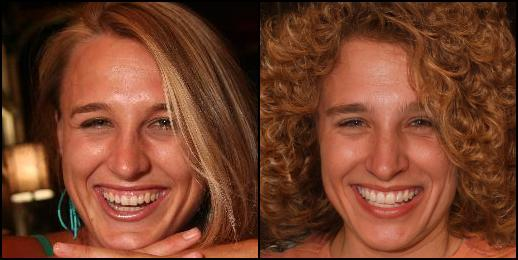

# Minimalistic StyleCLIP
This repository contains the minimal code to do text-based face editing based on the [StyleCLIP](https://github.com/orpatashnik/StyleCLIP) method. 

## Requirements
CUDA supported GPU, Python3.7+

## Instructions
### 1. Install required python libraries
```
pip install -r requirements.txt
```
### 2. Download model checkpoints
Download https://www.dropbox.com/s/sutyapujaphgaau/e4e_ffhq_encode.pt?dl=0 and put it in clipstyle/pretrained/

Download https://www.dropbox.com/s/qdljpc1ssmd0ai5/ffhq_statedict.pt?dl=0 and put it in clipstyle/pretrained


## Example Usage
```
python main.py --gpu 0 --text a_face_with_curly_hair --img input/1.jpg
```

